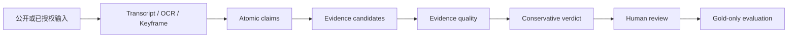

# Truthfulness（求真）· v0.1 Seed

一个面向自然语言信息的、证据优先的求真原型。当前 v0.1 Seed 选择**视频求真**作为验证框架：把视频内容拆为可核查主张，再连接证据、质量信号、保守结论和人工复核。视频只是当前版本的输入场景与工程切入点，不等同于项目的长期问题边界。

> 这是用于应届生求职技术交流的短期公开快照。从立项到 v0.1 Seed 的基础实现累计不足两周。它证明的是工程方向、数据契约和最小闭环已跑通，**不代表模型已经可用，更不代表具备生产级“判真”能力**。

## 版本边界

v0.1 Seed 以视频求真为当前框架，完成了离线可运行样例、结构化 schema、主张/证据/结论的接口边界、gold-only 数据加载、数据泄漏检查、分组切分和轻量 baseline smoke。它没有完成可靠的真实性分类模型、真实视频数据集发布、跨输入场景的泛化评测或生产部署。

当前公开版本只用于展示工程能力与判断边界。任何指标都应结合样本规模、类别不平衡和数据来源限制阅读，不能被理解为模型最终效果或事实结论。

## 这个项目可以用来做什么

### 当前 v0.1：展示思路与基础框架

v0.1 Seed 目前**没有可直接投入业务的实用价值**。它只用于证明一条技术路线能够被工程化表达：从非结构化内容中抽取 claim，记录证据及其来源深度，标记上下文缺口与不确定性，再通过人工审核形成可用于评测的结构化数据。

因此，当前版本不能承担自动事实核查、内容审核、投资判断或高风险决策，也不应以现有指标推断未来产品效果。它是后续研发的 seed、schema 与最小闭环，不是已经完成的噪音过滤产品。

### 最终定位：证据感知的信息噪音过滤器

Truthfulness 的长期目标，是成为位于**原始信息**与**下游模型或人的决策**之间的一层可信度与不确定性过滤器。它不试图宣布一个说法“绝对为真”，而是把混杂的信息压缩成更适合审阅和计算的结构：

- 关键 claim：内容究竟提出了哪些可核查说法；
- 关键证据：每个说法依据什么，来源是一手材料、二手转述还是只有线索；
- 关键不确定性：缺少哪些条件、上下文或反方证据；
- 关键风险：是否存在过时信息、单位/时间错配、因果倒置、样本偏差、偷换概念、来源漂白或“半真半假”；
- 建议动作：通过、降权、补充检索、进入人工复核，或从下游数据集中排除。

换句话说，系统的核心输出不是一个孤立的“真假分数”，而是一份可追溯的**信号、证据、缺口与风险说明**。

### 可能的应用方向

| 场景 | 噪音过滤作用 | 典型产物 |
| --- | --- | --- |
| 大语言模型训练前置过滤 | 在文本进入预训练、微调或评测集之前，识别营销内容、错误科普、伪专家表述、过时新闻、二手转述和相互矛盾的样本 | 样本可信度特征、保留/降权/排除建议、hard negative、事实性评测集 |
| 训练数据清洗与数据治理 | 将 claim、证据深度、来源关系、时间有效性和“半真半假”结构显式化，降低弱标签直接污染训练面的风险 | 版本化数据集、来源追踪、冲突样本、人工 gold 队列 |
| RAG、Agent 与知识库入口 | 在内容进入检索库、长期记忆或 Agent 上下文前检查来源、时效性、引用完整性和相互矛盾关系 | 可引用片段、证据等级、过期标记、冲突簇、拒答条件 |
| 个人信息与决策辅助 | 减少阅读负担，让人优先看到关键 claim、关键证据、反例和真正影响决策的不确定条件 | 决策摘要、证据对照表、待确认问题、风险清单 |
| 投研与企业风控 | 检查财报、公告、新闻、路演和舆情中的口径变化、数据基期、单位、时间窗口、利益相关方与因果跳跃 | 主张—证据矩阵、异常口径提示、证据缺口、人工升级队列 |
| 法律辅助与合规审核 | 对材料中的事实主张、引用出处、时间线、前提条件和冲突陈述进行结构化整理 | 事实时间线、出处索引、矛盾点、待律师确认事项 |
| 医学科普与健康内容审核 | 识别相对风险替代绝对风险、样本人群不匹配、动物实验外推、旧指南和夸大疗效等常见噪音 | 适用人群、研究层级、风险口径、证据更新日期、人工审核提示 |
| 公共政策与媒体事实核查 | 拆分统计事实、历史比较、政策解释、预测意见和因果判断，避免把不同证据类型混为一谈 | claim 清单、来源层级、口径差异、缺失上下文、可复核报告 |
| 内容平台治理 | 将机器初筛用于排序和分流，把高传播风险、低证据质量或高不确定内容优先交给人工审核 | 风险分层、复核优先级、解释字段、申诉所需证据 |
| 金融量化研究的数据入口 | 在新闻、纪要和舆情进入特征工程前检查发布时间、事件时间、单位、重复转载、前视偏差和因果表述 | 信息质量特征、事件对齐结果、去重簇、不可用样本标记 |

在法律、医学、金融和公共政策等高风险场景中，Truthfulness 只能作为**证据整理、噪音识别与人工决策支持层**，不能替代律师、医生、投研人员或政策专家，也不直接生成交易信号或最终处置意见。

### 它希望回答的问题

面对“某药降低风险 50%”“某公司收入增长 30%”“某项政策导致市场上涨”这类表述，系统不应停留在关键词匹配，而应继续追问：

- 这是相对变化还是绝对变化？同比、环比还是选择性区间？
- 对应的样本、人群、SKU、市场、时间和统计口径是什么？
- 引用的是原始研究、正式公告，还是经过多次转述的二手内容？
- 证据能支持完整结论，还是只支持其中一部分？
- 时间先后是否被包装成因果关系？是否遗漏反例、限制条件或利益冲突？

这类结构化追问，才是“噪音过滤”能够为模型训练、知识系统和人类决策提供的核心价值。

## 如果你是招聘方

建议按以下顺序快速查看：

1. [v0.1 成果汇报](report/v0.1成果汇报.md)：先看已完成事项、指标和明确的失效边界。
2. [接口设计](docs/interfaces.md) 与 [文件布局](docs/file_layout.md)：查看数据流、可替换 Provider 和运行产物隔离方式。
3. `src/video_truthfulness/`：查看 Pydantic 数据契约、离线 pipeline、证据评分、失败回退和 gold-only smoke baseline。
4. `tests/`：查看 schema、离线流程、媒体入口和训练数据边界的自动化测试。
5. [优化方案参考](Optmize/优化方案参考.md)：查看从 v0.1 到下一阶段的工程取舍。

这个版本特别想展示的不是“调用一个模型得到结论”，而是以下工程判断：

- 将具体输入整体判断拆解为 claim、evidence、verdict 和人工复核边界；v0.1 的具体输入是视频；
- 用结构化字段、严格校验和泄漏检查保护后续训练面；
- 让下载、转写、检索和模型服务通过接口隔离，失败时保留可诊断状态；
- 只把 `gold_*` 且显式允许训练/评测的记录放入 smoke baseline；
- 对不平衡数据、弱标签和小样本指标保持保守表述。

### 多智能体协作与责任边界

v0.1 Seed 快照的主要实现与结果产出早于 GPT-5.6 发布。本轮采用受控的多智能体协作，而非将任一模型输出直接视为结论：Claude Code 用于方案细节的审阅、风险识别与调整建议；GPT 参与代码实现、方案设计、文档归类及基础网络查询；Gemini 在机器初筛完成后，承担待核查主张的深度溯源辅助。

项目作者负责定义问题边界、拆分任务、确定验收标准、审查证据与合并最终结果。模型输出必须回落到 schema、测试、可追溯证据或人工复核，不能替代工程判断或事实依据。

## 如果你是开发者

公开仓库可直接运行不访问平台、不调用 LLM 的离线 MVP：

```powershell
python -m pip install -e ".[dev]"
python -m pytest -q -p no:cacheprovider
python -m video_truthfulness.cli offline `
  --transcript examples/offline_demo/transcript.json `
  --evidence examples/offline_demo/evidence.json `
  --title offline_demo
```

该示例只使用合成的 transcript 与证据元数据，并使用现有 v0.1 离线演示布局写入 Git 忽略的 `runs/<run_id>/`；它不创建真实 v0.2 来源 run。新的 v0.2 YouTube run 必须遵守 [版本与 canonical ID 规范](docs/version_and_id_system.md)，使用 `runs/V02/run_<ulid>/`。如需查看 UI 壳层，可安装 `.[ui]` 后运行：

```powershell
streamlit run app/streamlit_app.py
```

### 7.15 日更新 v0.1 工程增强：可评测的证据 Agent

我查阅了中国大陆地区主流招聘平台的部分岗位对于AI应用方面的具体要求，总结并在不改变 v0.1 数据集的前提下新增了一条完全使用合成来源的 Agent/RAG 工程链路。由于后续数据集 schema 仍然会出现改动，该链路只代表 v0.1 版本的评测性增强。

- LangGraph 显式状态流：分类 → Chroma 检索 → 证据检查 → 结构化生成 → 引用验证 → 拒答或人工升级；
- 两个受限工具：查询已入库来源信息、创建 SQLite 人工复核任务；
- FastEmbed 中文 ONNX embedding 与 Chroma 持久化向量检索；
- FastAPI 严格请求/响应模型、OpenAPI 文档，以及现有 Streamlit 的 Evidence Agent 页面；
- `trace_id`、逐节点耗时、总耗时、token/成本来源、重试次数、超时与失败状态；
- 20 条固定合成评测，覆盖引用正确、无答案、提示注入、越权、超时和拒答；
- Dockerfile、Compose 和 Ubuntu/WSL 一键启动脚本。

```bash
bash scripts/start_agent_demo.sh
```

启动后访问：

- FastAPI/OpenAPI：`http://localhost:8000/docs`
- Streamlit：`http://localhost:8501`

固定评测可独立运行：

```bash
PYTHONPATH=src python -m video_truthfulness.evals \
  --embedding-backend fastembed \
  --runtime-dir runtime/eval-fastembed
```

当前公开评测结果是 **20/20 PASS**，但它只证明合成用例下的路由、引用、安全与失败处理契约成立，不代表真实世界事实核查准确率。完整设计、状态与验收边界见 [Evidence Agent 文档](docs/agent_rag.md)。

训练入口只接受调用方自行准备的、已完成审核的 `gold_*` JSONL；它当前是数据校验、确定性切分和多数类 baseline 的 smoke 工具，不是正式训练器。可参考 `configs/train_baseline.smoke.example.toml`，不要将 pending 或 excluded 记录混入训练面。

### 7.17 日更新 v0.1补充：训练数据质量门禁

我在查阅金融量化及相关数据工程岗位时，我注意到部分岗位的数据工作重点并非传统交易数据仓库，而是训练数据管道、预训练/SFT/RLHF 数据准备、质量治理与合成数据。基于这一要求，项目在复用 v0.1 既有私有数据的前提下完成了一次最小的 v0.1.1 增强；机器初筛 `Initial-screening` 和人工 gold `Manual-annotation` 的 schema 均未改变，真实记录继续只保存在本地。

本次更新采用“质量门禁为核心、任务准入为核心、派生数据为输出、小型人工偏好验证为补充”的范围：

- **质量与可追溯性**：冻结输入与 split 哈希，显式记录数据、Schema、流水线版本和父子 lineage；检查字段完整性、精确重复、MinHash/LSH 近重复候选和跨 split 污染；
- **按任务准入**：分别为 claim-triage SFT、证据型 SFT、合成样本父记录、真实性评测和公开发布输出 `pass`、`quarantine` 或 `reject`，不使用一个模糊的全局“可训练”标志；
- **SFT 派生输出**：只从合格记录构造 claim-triage SFT；证据元数据不足时不训练“直接判真”，也不把弱标签包装成人工 gold；
- **受控合成数据**：通过时间偏移、单位/数量级错误、上下文删除、局部事实扩大、观点或预测事实化、来源漂白等 mutation 生成带父记录和 split 继承关系的 hard negative；
- **小型偏好验证**：生成 30 条仅供单人人工 `accept/edit/reject` 的本地待复核 pair；人工写回前状态保持 `pending`，不宣称已经完成 RLHF、DPO 或偏好数据生产；
- **可复现输出**：公开 JSON Schema、纯合成 fixture 和聚合报告；本地私有运行可输出 JSONL 与 Parquet，真实 claim、证据和人工标注不进入公开仓库。

私有 v0.1 数据的本地门禁运行只公开聚合结果：424 条输入中硬错误为 0，412 条通过 claim-triage SFT 准入，派生 100 条受控合成样本和 30 条待人工复核偏好对。由于 424 条记录都缺少完整的证据元数据，它们全部被隔离在 evidence-grounded SFT 和 truthfulness evaluation 之外；这一结果证明门禁能阻止不合格数据进入对应任务，不证明模型质量提升。

公开演示只使用 8 条完全虚构记录：

```bash
PYTHONPATH=src python -m video_truthfulness.cli training-data-pack \
  --config configs/training_data_quality.example.toml
```

当前公开 fixture 可重复生成 8 条质量记录、8 条 claim-triage SFT、6 条受控合成样本和 4 条待复核偏好对。完整边界见 [Training-data quality pack](docs/training_data_quality.md)。这些数量只证明数据契约与门禁可运行，不代表真实数据公开、模型训练完成或模型质量提升。

### 协作工作流

本快照在 GPT-5.6 发布前完成，使用了按职责分层的多智能体工作流：Claude Code 负责方案细节评估与调整建议，GPT 覆盖代码、方案、文档和基础网络查询环节，Gemini 负责机器初筛后的深度溯源辅助。该分工将“生成/实现”“初步筛查”“证据深查”分开，减少单一模型在同一主张上既生成又自证的风险。

若要复用此工作流，应保留人工验收节点：将每个代理的输入、输出、证据路径和失败状态写入结构化产物；由人工决定是否升级结论、写入 gold 数据或进入后续训练。任何模型生成内容都不是外部证据。

## 架构方向：v0.1 视频求真框架



| 层次 | v0.1 Seed 已展示的内容 | 仍需继续完成的内容 |
| --- | --- | --- |
| 数据层 | 结构化字段、原子主张修复、泄漏检查、分组切分 | 合规可发布数据集、类别均衡与双人复核 |
| 规则与接口 | Pydantic schema、Provider 边界、失败回退 | 真实检索/转写服务的稳定实现 |
| 评测层 | gold-only 校验与 smoke baseline | 独立测试集、校准、误差分析和版本对比 |
| 产品层 | Streamlit 离线 MVP 壳层 | 可控部署、权限与完整人工工作台 |

## v0.1 Seed 结果摘要

本轮本地审计共整理 424 条 seed 记录，其中 414 条进入主训练/评测任务；硬错误、重复键和已知标签泄漏均为 0。`include_decision` 的弱 baseline 表现相对最好，但其他任务明显受到类别不平衡影响。完整数字、解释和不可宣传边界见 [v0.1 成果汇报](report/v0.1成果汇报.md)。

尤其需要强调：truthfulness status 在 v0.1 中只是 calibration smoke，不能被称为真实性模型；高 accuracy 可以由多数类获得，不能替代人工核查。

## 公开范围与隐私处理

本快照采用白名单式公开：

| 公开 | 原因 |
| --- | --- |
| `src/`（来源特定 seed 构建器除外）、`app/`、`tests/` | 可审阅的通用实现、边界控制与测试 |
| `examples/`、`configs/*.example.toml`、`docs/` | 合成样例、无密钥配置和工程接口说明 |
| `report/v0.1成果汇报.md`、`report/Annotation-example.md` | 仅含汇总结果与字段 schema，不含标注内容 |
| `Optmize/优化方案参考.md` | 脱敏后的后续工程方向 |

下列内容不公开：真实视频运行目录、下载媒体、截图、全量机器/人工标注、seed JSONL、实验日志与切分文件、原始优化过程、Cookie 工具、个人环境路径以及依赖这些私有输入的来源特定构建器。这样既不发布第三方平台内容，也不把本地凭证和个人工作流带入提交历史。

## 非协商边界

- 只处理公开内容或明确授权输入；不绕过登录、付费墙、DRM 或平台访问控制。
- Cookie、Token、账号信息、真实媒体和运行产物均为本地私有输入，不能提交。
- LLM 输出不是证据；无可靠证据时应保留 `insufficient_evidence` 或人工复核状态。
- 不将本项目输出用作医疗、法律、金融或其他高风险领域的最终建议。

## License

本公开快照使用 [Apache-2.0](LICENSE) 协议。
