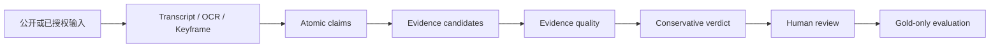

# Truthfulness（求真）· v0.1 Seed

一个面向自然语言信息的、证据优先的求真原型。当前 v0.1 Seed 选择**视频求真**作为验证框架：把视频内容拆为可核查主张，再连接证据、质量信号、保守结论和人工复核。视频只是当前版本的输入场景与工程切入点，不等同于项目的长期问题边界。

> 这是用于应届生求职技术交流的短期公开快照。从立项到 v0.1 Seed 的基础实现累计不足两周。它证明的是工程方向、数据契约和最小闭环已跑通，**不代表模型已经可用，更不代表具备生产级“判真”能力**。

## 版本边界

v0.1 Seed 以视频求真为当前框架，完成了离线可运行样例、结构化 schema、主张/证据/结论的接口边界、gold-only 数据加载、数据泄漏检查、分组切分和轻量 baseline smoke。它没有完成可靠的真实性分类模型、真实视频数据集发布、跨输入场景的泛化评测或生产部署。

当前公开版本只用于展示工程能力与判断边界。任何指标都应结合样本规模、类别不平衡和数据来源限制阅读，不能被理解为模型最终效果或事实结论。

## 如果你是招聘方

建议按以下顺序快速查看：

1. [v0.1 成果汇报](report/v0.1成果汇报.md)：先看已完成事项、指标和明确的失效边界。
2. [接口设计](docs/interfaces.md) 与 [文件布局](docs/file_layout.md)：查看数据流、可替换 Provider 和运行产物隔离方式。
3. `src/video_truthfulness/`：查看 Pydantic 数据契约、离线 pipeline、证据评分、失败回退和 gold-only smoke baseline。
4. `tests/`：查看 schema、离线流程、媒体入口和训练数据边界的自动化测试。
5. [优化方案参考](Optmize/优化方案参考.md)：查看从 v0.1 到下一阶段的工程取舍。

这个版本特别想展示的不是“调用一个模型得到结论”，而是以下工程判断：

- 将具体输入整体判断拆解为 claim、evidence、verdict 和人工复核边界；v0.1 的具体输入是视频；
- 用结构化字段、严格校验和泄漏检查保护后续训练面；
- 让下载、转写、检索和模型服务通过接口隔离，失败时保留可诊断状态；
- 只把 `gold_*` 且显式允许训练/评测的记录放入 smoke baseline；
- 对不平衡数据、弱标签和小样本指标保持保守表述。

### 多智能体协作与责任边界

v0.1 Seed 快照的主要实现与结果产出早于 GPT-5.6 发布。本轮采用受控的多智能体协作，而非将任一模型输出直接视为结论：Claude Code 用于方案细节的审阅、风险识别与调整建议；GPT 参与代码实现、方案设计、文档归类及基础网络查询；Gemini 在机器初筛完成后，承担待核查主张的深度溯源辅助。

项目作者负责定义问题边界、拆分任务、确定验收标准、审查证据与合并最终结果。模型输出必须回落到 schema、测试、可追溯证据或人工复核，不能替代工程判断或事实依据。

## 如果你是开发者

公开仓库可直接运行不访问平台、不调用 LLM 的离线 MVP：

```powershell
python -m pip install -e ".[dev]"
python -m pytest -q -p no:cacheprovider
python -m video_truthfulness.cli offline `
  --transcript examples/offline_demo/transcript.json `
  --evidence examples/offline_demo/evidence.json `
  --title offline_demo
```

该示例只使用合成的 transcript 与证据元数据，并把输出写入 Git 忽略的 `runs/<run_id>/`。如需查看 UI 壳层，可安装 `.[ui]` 后运行：

```powershell
streamlit run app/streamlit_app.py
```

训练入口只接受调用方自行准备的、已完成审核的 `gold_*` JSONL；它当前是数据校验、确定性切分和多数类 baseline 的 smoke 工具，不是正式训练器。可参考 `configs/train_baseline.smoke.example.toml`，不要将 pending 或 excluded 记录混入训练面。

### 协作工作流

本快照在 GPT-5.6 发布前完成，使用了按职责分层的多智能体工作流：Claude Code 负责方案细节评估与调整建议，GPT 覆盖代码、方案、文档和基础网络查询环节，Gemini 负责机器初筛后的深度溯源辅助。该分工将“生成/实现”“初步筛查”“证据深查”分开，减少单一模型在同一主张上既生成又自证的风险。

若要复用此工作流，应保留人工验收节点：将每个代理的输入、输出、证据路径和失败状态写入结构化产物；由人工决定是否升级结论、写入 gold 数据或进入后续训练。任何模型生成内容都不是外部证据。

## 架构方向：v0.1 视频求真框架



| 层次 | v0.1 Seed 已展示的内容 | 仍需继续完成的内容 |
| --- | --- | --- |
| 数据层 | 结构化字段、原子主张修复、泄漏检查、分组切分 | 合规可发布数据集、类别均衡与双人复核 |
| 规则与接口 | Pydantic schema、Provider 边界、失败回退 | 真实检索/转写服务的稳定实现 |
| 评测层 | gold-only 校验与 smoke baseline | 独立测试集、校准、误差分析和版本对比 |
| 产品层 | Streamlit 离线 MVP 壳层 | 可控部署、权限与完整人工工作台 |

## v0.1 Seed 结果摘要

本轮本地审计共整理 424 条 seed 记录，其中 414 条进入主训练/评测任务；硬错误、重复键和已知标签泄漏均为 0。`include_decision` 的弱 baseline 表现相对最好，但其他任务明显受到类别不平衡影响。完整数字、解释和不可宣传边界见 [v0.1 成果汇报](report/v0.1成果汇报.md)。

尤其需要强调：truthfulness status 在 v0.1 中只是 calibration smoke，不能被称为真实性模型；高 accuracy 可以由多数类获得，不能替代人工核查。

## 公开范围与隐私处理

本快照采用白名单式公开：

| 公开 | 原因 |
| --- | --- |
| `src/`（来源特定 seed 构建器除外）、`app/`、`tests/` | 可审阅的通用实现、边界控制与测试 |
| `examples/`、`configs/*.example.toml`、`docs/` | 合成样例、无密钥配置和工程接口说明 |
| `report/v0.1成果汇报.md`、`report/Annotation-example.md` | 仅含汇总结果与字段 schema，不含标注内容 |
| `Optmize/优化方案参考.md` | 脱敏后的后续工程方向 |

下列内容不公开：真实视频运行目录、下载媒体、截图、全量机器/人工标注、seed JSONL、实验日志与切分文件、原始优化过程、教学材料、Cookie 工具、个人环境路径以及依赖这些私有输入的来源特定构建器。这样既不发布第三方平台内容，也不把本地凭证和个人工作流带入提交历史。

## 非协商边界

- 只处理公开内容或明确授权输入；不绕过登录、付费墙、DRM 或平台访问控制。
- Cookie、Token、账号信息、真实媒体和运行产物均为本地私有输入，不能提交。
- LLM 输出不是证据；无可靠证据时应保留 `insufficient_evidence` 或人工复核状态。
- 不将本项目输出用作医疗、法律、金融或其他高风险领域的最终建议。

## License

本公开快照使用 [Apache-2.0](LICENSE) 协议。
