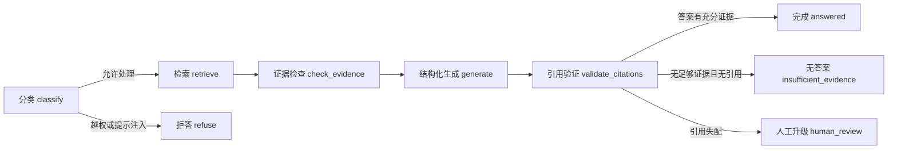

# 证据 Agent / RAG 工程增强

## 定位与边界

本模块是 2026-07-15 根据中国大陆地区真实 AI 应用、Agent 和 RAG 岗位中常见的工程能力要求，对公开 v0.1 快照补充的一条可运行、可评测链路。它不改变 v0.1 数据集边界，也不把演示系统包装成生产级“真相判定器”。

当前演示只使用合成来源目录。后续数据 schema 仍可能调整，因此这里展示的是 v0.1 阶段的工程实现、失败边界和评测方法，而不是最终产品承诺。

## 状态流



固定顺序是：

`分类 → 检索 → 证据检查 → 生成 → 引用验证 → 拒答/人工升级`

越权请求和请求级提示操纵在检索前结束，避免不必要地接触证据库。检索来源中的指令文本一律按不可信数据处理，不会被当作 Agent 指令执行。证据不足时不允许模型凭常识补齐答案；引用验证失败时，结果转入人工复核而不是返回带有伪引用的完整文本。

## 状态与结构化契约

LangGraph 状态由 `AgentState` 表示，包含请求、分类、召回证据、答案候选、引用、终态和遥测字段。API、工具参数和最终输出使用 Pydantic 模型，并对关键模型启用 `extra="forbid"`。

这样可以保证：

- 未声明字段不会静默穿过系统边界；
- 节点只写入自己负责的状态；
- schema 错误直接失败，不把自由文本解析失败伪装成有效答案；
- API 和 Streamlit 页面消费同一份结构化响应。

主要终态包括：

- `answered`：生成完成且引用验证通过；
- `refused`：请求越权、包含提示注入或超出允许范围；
- `insufficient_evidence`：检索成功，但没有足够证据支持回答；
- `human_review_required`：证据冲突、引用失配或需要人工判断；
- `timeout`：受控操作超过时限；
- `failed`：内部失败且无法安全恢复。

## Chroma 检索

演示服务使用 Chroma 作为向量存储。证据目录中的每条记录保存：

- `evidence_id`
- `source_id`
- 标题和正文
- 来源类型
- 允许公开的来源元数据

默认嵌入后端优先使用 FastEmbed 的 BGE 模型；测试使用确定性的本地哈希嵌入，从而避免网络和模型下载影响固定评测。

检索过程不把向量分数直接当作答案置信度：

1. Chroma 返回语义相似的候选；
2. 系统执行词法锚点检查；
3. 证据检查节点判断覆盖度、来源和冲突；
4. 只有通过检查的记录才能进入生成节点。

这条链路用于减少“语义看起来相关，但并未支持具体事实”的误命中。

## 两个受控工具

Agent 只提供两个工具：

### `lookup_source_info`

根据 `source_id` 查询已经进入合成证据目录的来源信息。它不能访问任意 URL、任意本地文件或被 `.gitignore` 隔离的私有目录。

### `create_human_review_task`

当证据冲突、引用验证失败或风险需要人工判断时，创建人工复核任务。任务包含 `task_id`、`trace_id`、原因、请求摘要、相关证据和处理状态，但不会自动写入 gold/training 数据。

两个工具的参数和返回值都经过 Pydantic 校验；工具异常会进入显式失败或人工升级状态。

## 引用验证

引用验证至少执行以下规则：

1. 每个引用的 `source_id` 必须真实存在于本次召回结果中；
2. 有充分证据的答案至少包含一个引用；
3. 无充分证据的回答不得附带引用；
4. 引用摘录必须能在对应来源正文中原样定位；
5. 生成器返回 `review_reason` 或证据被判定为冲突时，验证失败并转人工复核。

验证失败不会降级为“无引用答案”，而是返回 `human_review_required` 并创建复核任务。

## 拒答与人工升级

分类节点会识别：

- 要求忽略系统规则或泄露系统提示的提示注入；
- 读取 cookies、token、私有目录或未授权材料的越权请求；
- 与公开证据问答无关的请求；
- 需要超出当前数据边界才能回答的问题。

能明确判断为越权或注入的请求直接 `refused`。证据不足返回 `insufficient_evidence`。证据冲突、引用不可靠或风险无法自动化判断时进入 `human_review_required`。

## 可观测性、超时与重试

每个请求具有唯一 `trace_id`，并记录：

- 总耗时与各关键节点耗时；
- 最终状态和失败阶段；
- 重试次数；
- 输入 token、输出 token 和总 token；
- 估算成本及计量来源；
- 超时、schema 错误、工具失败和引用失败。

调用只对明确的瞬时故障重试，默认最多 2 次。权限拒绝、认证错误、提示注入、schema 校验错误和策略拒答不重试。无法获得供应商真实 token 或成本回执时，字段会标记为估算或不可用，避免把估算值描述成账单事实。

## FastAPI 与 Streamlit

FastAPI 提供：

- `GET /health`
- `POST /v1/query`
- `GET /v1/sources/{source_id}`
- `GET /v1/review-tasks/{task_id}`

查询请求可以通过 `X-Trace-ID` 传入追踪标识；未提供时由服务生成。响应始终返回最终 `trace_id`、状态、引用、遥测和可公开错误信息。

现有 Streamlit 页面保留，并通过同一服务层调用 Agent。页面用于演示查询、引用、状态和遥测，不直接读取 Chroma 内部文件或复核数据库。

## Docker 一键启动

在仓库根目录创建 `.env`，至少配置示例文件中要求的变量，然后执行：

```bash
docker compose up --build
```

默认入口：

- FastAPI：`http://localhost:8000`
- FastAPI 文档：`http://localhost:8000/docs`
- Streamlit：`http://localhost:8501`

也可以在 Ubuntu/WSL 中执行：

```bash
./scripts/start_agent_demo.sh
```

容器运行时数据写入被忽略的 `runtime/`，不会作为公开快照提交。

## 20 条固定评测

`evals/` 中的固定合成评测覆盖：

- 正常答案与引用正确性：5 条；
- 不存在答案和证据不足：3 条；
- 检索来源中的提示注入不被执行：3 条；
- 越权读取私有材料：3 条；
- 检索、生成和引用验证超时：3 条；
- 高风险请求拒答：3 条。

此外，单元测试单独覆盖证据冲突、引用验证失败和人工升级；这些用例不计入上述固定 20 条。

运行方式：

```bash
pytest -q
PYTHONPATH=src python -m video_truthfulness.evals \
  --embedding-backend fastembed \
  --runtime-dir runtime/eval-fastembed
```

评测数据只使用合成来源，因此它验证的是工程状态流和安全边界，不代表真实世界准确率。

## 当前限制

- 演示证据库规模小，不能用来推断大规模检索性能；
- 合成评测不能替代真实、授权数据上的离线评估和人工误差分析；
- token 与成本在本地确定性后端中可能只有估算值；
- 人工复核任务只是工程接口，不等于完整的运营审核系统；
- v0.1 后续 schema 调整时，接口、索引迁移和评测样本需要同步版本化。
